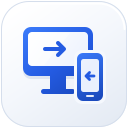

  
  <h1>西西远程 · CC Remote</h1>
  
<strong>跨越屏幕，连接你的设备。</strong>

  
为 Windows 与 Android 打造的远程控制软件。 安装客户端，输入设备 ID，让手机与电脑之间的连接更简单。

  
<strong>Windows · Android · Preview</strong>

  
<a href="#预览版下载">下载预览版</a> · <a href="#三步开始连接">开始使用</a> · <a href="SOURCE.md">源码说明</a>

---

### 设备由你来定义

- **输入 ID 连接**：两端使用统一的设备 ID 连接方式，连接服务已内置。
- **自由命名和管理**：按你的需要给设备命名，不预设家里、办公室或固定角色。
- **连接后自动记录**：点击连接会保存设备，方便下一次找到并再次接入。
- **安装一个客户端即可**：远控引擎随西西远程一起提供，无需另外安装或启动 RustDesk。
- **适合各自的屏幕**：桌面端和手机端各有自己的布局，采用统一的银白与钴蓝风格。

### 预览说明

当前版本仍在联测，尚未完成所有连接方向的验收。手机版的无人值守、锁屏、长时间后台运行及操作性能仍待实机验证；重启后自动恢复也尚未完成验收。桌面预览版提供共享时，需要保持客户端运行。

### 预览版下载

[打开下载页](https://videopmt.com:8443/)

| 平台 | 版本 | 安装包 | 对应完整源码 |
| --- | --- | --- | --- |
| Windows | 0.5.2-preview | [下载安装程序](https://videopmt.com:8443/releases/windows/XiXiRemoteSetup.exe) | [Windows 源码](sources/windows/0.5.2-preview) |
| Android | 0.1.6-preview | [下载 APK](https://videopmt.com:8443/releases/android/XiXiRemote.apk) | [Android 源码](sources/android/0.1.6-preview) |

### 三步开始连接

1. **安装并打开**：在控制端和被控端分别安装西西远程，查看被控端的本机 ID。
2. **输入设备 ID**：在控制端输入对方的 ID，点击“连接”。
3. **完成接入验证**：根据被控端的设置完成密码验证或接入确认，进入远程画面；设备会自动保存到列表中。

手机首次作为被控端时，需要按应用提示设置无障碍、屏幕采集和后台运行，并自行设置访问密码。不同 Android 版本和机型可能要求额外的系统确认，部分权限仍可能需要再次授权。

### 开源来源

西西远程基于 [RustDesk](https://github.com/rustdesk/rustdesk) 开源远控引擎开发，并遵循 [AGPL-3.0 许可证](LICENSE)。感谢上游项目的工作。完整源快照与构建方式见 [源码说明](SOURCE.md)，第三方来源见 [许可声明](THIRD-PARTY-NOTICES.md)。
